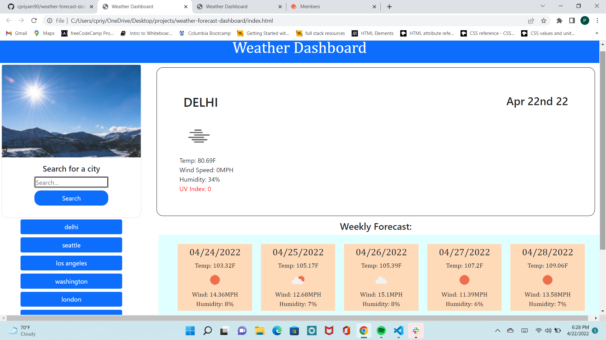

# weather-forecast-dashboard
## Description

The purpose of this application is to create a weather app so a user can plan for their day and week based on the weather forecast.

## Applications Used

HTML, CSS, JavaScript, Jquery, Bootstrap, Server-Side Apis. Application was created with the use OpenWeather Api. The following processes were followed
* HTML was created to display a form input for user to input the city name.
* Styling added using bootstrap and css.
* Moment.js code was built upon to display day and date at the top of the page.
* Script.js file was created to create functions to fetch and display current and weekly forecast from OpenWeather 
api.
* OpenWeather API

## Usage

This application provides a user a daily weather forecast for the searched city. The forecast includes temperature, wind speed, uv index and humidity. The weekly forecast displays the weather for a city for the week.

## Credits

* 1.Took a lot of assistance from my tutor Abdullah to think of logic and learn how to use API endpoints. With his help, I was able to understand and learn the logic and complete my assignment
* 2.Followed directions from my instructor Diego on using API endpoints and how to have my functions flow
* 3.Classmate Dimos helped me understand how to display weather icons based on information received from endpoint
* OpenWeather Api Documentation

## Challenges
Working with localStorage to save city information and display city name when user clicks on button of searched cities. 

## User Story

* AS A traveler
* I WANT to see the weather outlook for multiple cities
* SO THAT I can plan a trip accordingly

## Acceptance Criteria

* GIVEN a weather dashboard with form inputs
* WHEN I search for a city
* THEN I am presented with current and future conditions for that city and that city is added to the search history
* WHEN I view current weather conditions for that city
* THEN I am presented with the city name, the date, an icon representation of weather conditions, the temperature, the humidity, the wind speed, * * and the UV index
* WHEN I view the UV index
* THEN I am presented with a color that indicates whether the conditions are favorable, moderate, or severe
* WHEN I view future weather conditions for that city
* THEN I am presented with a 5-day forecast that displays the date, an icon representation of weather conditions, the temperature, the wind speed, * and the humidity
* WHEN I click on a city in the search history
* THEN I am again presented with current and future conditions for that city

## Screenshot

## Link to deployed page

[Weather Forecast Dashboard](https://cpriyam90.github.io/weather-forecast-dashboard/)
